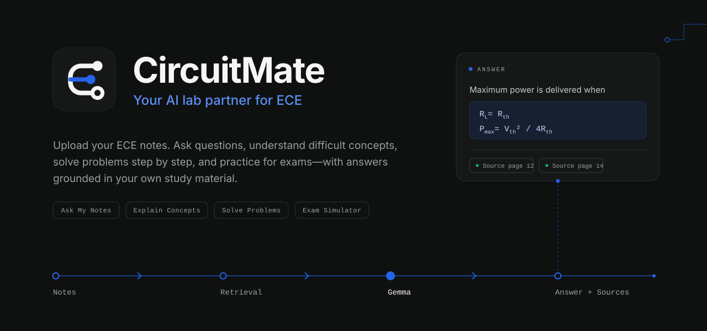

<p align="center">
  
</p>

<p align="center">
  <code>Notes → Retrieval → Gemma → Answer + Sources</code>
</p>

<p align="center">
  <a href="#features">Features</a> ·
  <a href="#how-it-works">How it works</a> ·
  <a href="#getting-started">Getting started</a> ·
  <a href="#api">API</a> ·
  <a href="#project-structure">Structure</a> ·
  <a href="#roadmap">Roadmap</a>
</p>

---

CircuitMate is an open-source study workspace for Electronics & Communication Engineering students. You upload your own notes as a PDF, and CircuitMate answers from that material, with the source pages shown next to each answer.

It is not a general chatbot with a file upload. Every mode is built around how ECE students actually study: look something up, understand it, work a problem, then test yourself.

> Built for the DEV Community **Build for a Friend** challenge.

## Features

| Mode | What it does |
| --- | --- |
| **Ask My Notes** | Ask a question and get an answer drawn from your uploaded notes, with the source pages. |
| **Explain Concepts** | Breaks a difficult idea into concept, intuition, equation, example and an exam note. |
| **Solve Problems** | Works a problem as separate steps: Problem, Given, Approach, Solution, Result, Exam note. |
| **Exam Simulator** | Generates exam-style questions by subject, difficulty, marks (2 / 5 / 10) and type (theory, numerical, conceptual, mixed), then evaluates your answer. |

**Grounded by design**

- Answers come from your notes first, and source pages are listed with them.
- If the notes don't contain enough to answer, CircuitMate says so instead of presenting a guess as if it came from your material.
- The UI only shows page numbers it actually receives. It never invents section titles.

**Exam feedback that teaches**

- Score out of the question's marks, plus what you got right and what to improve.
- A model answer based on your notes, and the pages the evaluation used.

**Subjects:** Network Theory, Analog Electronics, Digital Electronics, Signals & Systems, Communication Systems, Electromagnetics, Microprocessors, and Other ECE.

## How it works

```text
PDF upload ──► split into indexed sections ──► retrieve relevant sections
                                                        │
                                                        ▼
                         Gemma ◄── question + retrieved notes
                           │
                           ▼
                  answer + source pages
```

1. **Upload.** Your PDF is read and indexed. The app shows the page count and the number of indexed sections.
2. **Retrieve.** For each question, the most relevant sections of your notes are retrieved.
3. **Generate.** Gemma answers using those sections, in the format the selected mode asks for.
4. **Cite.** The response returns with the pages it drew from.

## Getting started

### Prerequisites

- Node.js 20 or later
- The CircuitMate backend running locally (see below)

### Frontend

```bash
cd web
npm install
npm run dev
```

Open <http://localhost:3000>.

By default the frontend talks to `http://127.0.0.1:8000`. To point it somewhere else:

```bash
# web/.env.local
NEXT_PUBLIC_API_URL=http://127.0.0.1:8000
```

### Backend

<!-- TODO: add the real backend setup steps for this repo (folder name,
     install command, how Gemma is loaded, start command). -->

The backend must expose the endpoints listed in [API](#api) on port `8000`.

### Using it

1. Click **Upload notes** and choose a PDF.
2. Pick your study subject.
3. Switch between **Ask my notes**, **Explain concept**, **Solve problem** and **Exam simulator**.

## API

All endpoints are served by the backend at `NEXT_PUBLIC_API_URL`. Errors are returned with a `detail` message, which the UI shows to the user.

### `POST /api/documents/upload`

Multipart form with a `file` field (PDF).

```json
{ "filename": "Network Theory Notes.pdf", "pages": 46, "chunks": 51 }
```

### `POST /api/chat`

```json
{
  "message": "What is maximum power transfer?",
  "mode": "chat",
  "subject": "Network Theory"
}
```

`mode` is `chat`, `explain` or `solve`. Response:

```json
{ "answer": "...", "sources": [{ "page": 12, "score": 0.82 }] }
```

Solve answers are expected to use the section headings `PROBLEM:`, `GIVEN:`, `APPROACH:`, `SOLUTION:`, `RESULT:`, `EXAM NOTE:`, `SOURCES:` so the UI can render them as separate steps.

### `POST /api/exam/start`

```json
{
  "subject": "Network Theory",
  "difficulty": "medium",
  "marks": 5,
  "question_type": "theory"
}
```

`difficulty` is `easy`, `medium` or `hard`. `marks` is `2`, `5` or `10`. `question_type` is `theory`, `numerical`, `conceptual` or `mixed`. Response:

```json
{ "question": "...", "sources": [{ "page": 10, "score": 0.77 }] }
```

### `POST /api/exam/answer`

```json
{
  "question": "...",
  "answer": "...",
  "subject": "Network Theory",
  "marks": 5
}
```

Response:

```json
{ "evaluation": "...", "sources": [{ "page": 10, "score": 0.77 }] }
```

The evaluation text should contain a score line (for example `Score: 4/5`) and the headings **What you got right**, **What to improve** and **Model answer**. If it doesn't, the UI falls back to showing the raw feedback.

## Project structure

```text
web/app/
├── page.tsx                  # Composition only
├── types.ts                  # Shared types
├── globals.css               # Tokens, fonts, animations
├── hooks/
│   ├── useCircuitMate.ts     # State and API calls
│   └── useTypewriter.ts      # Progressive reveal
├── lib/
│   ├── api.ts                # Endpoint wrappers
│   ├── constants.ts          # Subjects, mode copy, suggestions
│   └── parsing.ts            # Section, equation and evaluation parsing
└── components/
    ├── brand/                # Logo and mark
    ├── layout/               # App shell, header
    ├── landing/              # Pre-upload screen
    ├── study/                # Workspace, messages, composer, sources
    ├── modes/                # Ask / Explain / Solve empty states
    ├── exam/                 # Exam simulator
    └── ui/                   # Buttons, cards, labels, loading states
```

All state and network calls live in `useCircuitMate`. Components receive props and render.

## Tech stack

- **Frontend:** Next.js (App Router), React, TypeScript, Tailwind CSS
- **Model:** Gemma
- **Type:** Geist for the interface, IBM Plex Mono for technical labels

## Roadmap

- True token streaming. The UI already reveals answers progressively, so switching to a streamed response only changes where the text comes from.
- Support for multiple documents per subject.
- Saved exam history, so you can see which topics keep costing you marks.

## Contributing

Issues and pull requests are welcome. If you're changing the UI, keep the existing direction: restrained, technical and readable, with decoration only where it carries meaning.

## License

<!-- TODO: choose a license and add a LICENSE file. -->

## Author

Built by [Mohammad Yasir](https://github.com/Yasir761).
